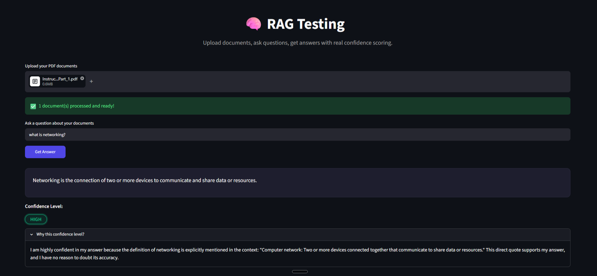

# 🧠 RAG Uncertainty Estimator

An AI-powered document Q&A system that doesn't just answer your questions — it tells you **how confident it is, and why**.

> Most RAG (Retrieval-Augmented Generation) systems answer questions and stop there. This one goes a step further: after every answer, it self-assesses its confidence as **LOW**, **MEDIUM**, or **HIGH**, and explains the reasoning behind that rating — grounded in whether the retrieved context actually supported the answer.

---

## 🔍 The Problem This Solves

Large Language Models are notorious for **hallucination** — confidently generating answers that sound plausible but are completely fabricated, especially when they don't actually know something. This is one of the most active, unsolved problems in AI today, with major companies investing heavily in mitigating it.

Most beginner RAG projects retrieve context, generate an answer, and stop — with no signal to the user about *how trustworthy* that answer actually is. This project treats that gap as the core problem to solve, not an afterthought.

## ✨ What It Does

1. **Upload** one or more PDF documents directly through the web interface
2. **Ask** a natural language question about their content
3. **Get an answer** generated strictly from your documents — not the model's general training data
4. **See a confidence rating** (HIGH / MEDIUM / LOW) with a plain-English explanation of *why* the model is or isn't confident
5. If the answer isn't actually in your documents, the system is instructed to say so — rather than guessing

---

## 🖼️ Demo

*(Add a screenshot of your app here — drag your image into this README on GitHub, or reference it like below)*

```

```

**🔗 Live Demo:** [Add your deployed Streamlit link here once live]

---

## 🏗️ How It Works

```
PDF Upload
    ↓
Text Extraction (pypdf)
    ↓
Chunking — split into overlapping ~500-character segments
    ↓
Embedding — each chunk converted to a 384-dim vector (Sentence Transformers)
    ↓
FAISS Vector Store — enables fast semantic similarity search
    ↓
User Question → embedded the same way → FAISS retrieves top-k relevant chunks
    ↓
Retrieved chunks + question → structured prompt → sent to LLM (Groq / Llama 3.1)
    ↓
LLM returns: Answer + Self-Rated Confidence + Reasoning
    ↓
Parsed and displayed in a clean, styled interface
```

### Why this approach?

- **Chunking with overlap** prevents ideas from being awkwardly cut off at chunk boundaries, preserving context across splits.
- **`all-MiniLM-L6-v2`** was chosen as the embedding model for its strong speed-to-quality tradeoff — it runs entirely locally with no API cost, and its compact 384-dimensional vectors keep the FAISS index lightweight without meaningfully sacrificing retrieval quality for this use case.
- **Confidence is derived from the retrieval-augmented prompt itself** — the LLM is explicitly instructed to answer *only* from provided context and to reason about whether that context actually supports its answer, rather than relying on an opaque internal probability score.

---

## 🛠️ Tech Stack

| Layer | Tool |
|---|---|
| Language | Python |
| Orchestration | LangChain |
| Embeddings | Sentence Transformers (`all-MiniLM-L6-v2`) |
| Vector Search | FAISS (Facebook AI Similarity Search) |
| LLM | Groq API (Llama 3.1 8B Instant) |
| PDF Parsing | pypdf |
| Frontend | Streamlit (custom CSS/HTML styling) |
| Deployment | Streamlit Community Cloud |

---

## 🚀 Running It Locally

**1. Clone the repository**
```bash
git clone https://github.com/AadharshM/rag---uncertainty---estimator.git
cd rag---uncertainty---estimator
```

**2. Create and activate a virtual environment**
```bash
python -m venv venv
venv\Scripts\activate      # Windows
source venv/bin/activate   # macOS/Linux
```

**3. Install dependencies**
```bash
pip install -r requirements.txt
```

**4. Set up your API key**

Create a `.env` file in the project root:
```
GROQ_API_KEY=your_groq_api_key_here
```
Get a free API key at [console.groq.com](https://console.groq.com).

**5. Run the app**
```bash
streamlit run src/app.py
```

---

## 📁 Project Structure

```
├── src/
│   ├── ingest.py       # PDF loading and text extraction
│   ├── chunker.py      # Splits documents into overlapping chunks
│   ├── embedder.py     # Builds embeddings + FAISS vector store, handles search
│   ├── parsing.py      # Parses LLM output into answer / confidence / reasoning
│   ├── llm_groq.py     # LLM prompt construction and Groq API calls
│   └── app.py          # Streamlit UI
├── requirements.txt
├── .gitignore
└── README.md
```

---

## 🗺️ Roadmap / Future Improvements

This project is intentionally built to grow in depth over time:

- [ ] Hybrid retrieval (semantic + keyword/BM25 search) for improved accuracy
- [ ] Faithfulness scoring — mathematically verify answers are grounded in retrieved text, rather than relying solely on LLM self-report
- [ ] Support for additional file types (Word, CSV, web pages)
- [ ] Persistent vector store (avoid rebuilding on every session)
- [ ] Conversation memory for multi-turn follow-up questions
- [ ] Evaluation framework to benchmark retrieval and confidence-calibration quality

---

## 📜 License

This project is open for learning purposes. Feel free to fork, adapt, and build on it.

---

*Built as a hands-on exploration of Retrieval-Augmented Generation and uncertainty estimation in LLM systems.*
